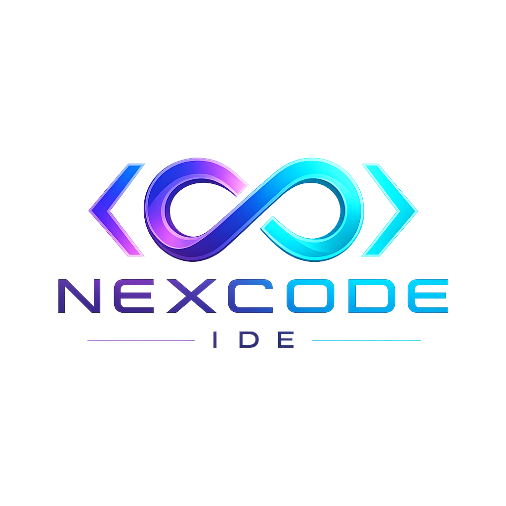

<div align="center">



### A lightweight, AI-optional, multiplayer IDE for macOS

_The full power of VSCode — faster, leaner, with first-class real-time collaboration,_
_an intelligent terminal, and an AI layer **you** control with your own keys._

<br/>

[](#)
[](https://tauri.app)
[](https://react.dev)
[](https://www.rust-lang.org)
[](https://www.typescriptlang.org)
[](#license)
[](#roadmap)

</div>

---

## ✨ Why NexCode?

VSCode is great — until Electron eats your RAM, LiveShare drops mid-session, and a merge
conflict turns into a guessing game. NexCode rebuilds the experience on a native, Rust-powered
shell and adds the things developers actually keep asking for.

> **Core principle:** every feature works with **zero API keys and zero internet**.
> AI is a progressive enhancement, never a requirement.

| Pain in VSCode                                   | How NexCode solves it                                                               |
| ------------------------------------------------ | ----------------------------------------------------------------------------------- |
| Electron — high RAM, slow startup                | **Tauri (Rust + system WebView)** — ~50 MB install, <1.5 s cold start, ~120 MB idle |
| Real-time collab needs proprietary tools         | **Yjs CRDT multiplayer** built in, self-hostable sync server, LAN auto-discovery    |
| Merge-conflict UX is painful                     | **3-panel IntelliJ-style resolver** — hunk-by-hunk accept/reject                    |
| AI tools quietly ship your code to third parties | **BYOK** — your own keys, token dashboard, privacy mode, direct-to-provider calls   |
| The terminal has no memory or intelligence       | **Persistent sessions** + natural-language-to-command with a local cache            |

---

## 🚀 Features

<table>
<tr>
<td width="50%" valign="top">

**⚡ Editor core**

- Monaco engine — 100+ languages, IntelliSense, multi-cursor
- Split panes, zen mode, sticky scroll, minimap
- Full LSP client (TS, Python, Rust, Go bundled)
- VSCode-compatible `settings.json` / `keybindings.json`

**🔀 Flagship merge resolver**

- 3-panel layout: yours · result · theirs
- Hunk navigator, conflict counter, inline commit
- Optional AI suggestion for the likely-correct merge

</td>
<td width="50%" valign="top">

**👥 Real-time multiplayer**

- Google-Docs-style co-editing (Yjs CRDT)
- Cursor presence, awareness, view-only/edit roles
- LAN (Bonjour/mDNS) or self-hosted sync server

**🧠 Smart terminal**

- Full PTY (zsh/bash/fish), session restore via SQLite
- `>> run this app` → shell command, cached locally
- Pay for each unique intent **once**

**🤖 AI layer — Bring Your Own Key**

- Chat, code review, commit messages, test generation
- OpenAI · Anthropic · Gemini · Groq · Ollama (offline)
- Keys in macOS Keychain · token dashboard · privacy mode

</td>
</tr>
</table>

---

## 🏗️ Tech stack

| Layer          | Technology                                                           |
| -------------- | -------------------------------------------------------------------- |
| Desktop shell  | **Tauri 2.0** (Rust) — native perf, system WebView                   |
| Editor core    | **Monaco** (the engine behind VSCode)                                |
| Frontend       | **React 19 + TypeScript + Vite**                                     |
| Real-time sync | **Yjs (CRDT)** + y-websocket                                         |
| Terminal       | **xterm.js** + node-pty                                              |
| Storage        | **SQLite** (sessions, NL cache), macOS **Keychain** (API keys)       |
| Git            | **isomorphic-git** + libgit2                                         |
| AI             | Custom **BYOK** router (OpenAI / Anthropic / Gemini / Groq / Ollama) |

---

## 📦 Monorepo layout

```
nexcode/
├── apps/
│   ├── desktop/        # Tauri 2.0 + React + TS + Vite — the IDE   (active)
│   │   ├── src/        #   editor · terminal · multiplayer · git
│   │   │               #   ai · merge-resolver · settings · lib
│   │   └── src-tauri/  #   Rust backend (commands, FS, keychain)
│   └── web/            # Next.js landing page                      (reserved)
├── packages/
│   └── sync-server/    # y-websocket multiplayer server + Docker   (reserved)
├── assets/             # Brand assets (logo, wordmarks)
├── docs/               # PRD + developer notes
├── scripts/            # Build / notarize / release
└── tests/              # Cross-app e2e (Playwright)
```

---

## 🛠️ Getting started

**Prerequisites**

- macOS 13 Ventura+ with Xcode Command Line Tools
- [Rust](https://rustup.rs) (stable) — `rustup target add aarch64-apple-darwin x86_64-apple-darwin`
- Node 20+ and [pnpm](https://pnpm.io) 11+ (`brew install pnpm`)

**Run it**

```bash
pnpm install     # install workspace dependencies
pnpm dev         # launch the desktop app (tauri dev)
```

**Other scripts**

```bash
pnpm build                          # bundle the macOS app (.app / .dmg)
pnpm -F @nexcode/desktop test       # unit tests (Vitest)
pnpm -F @nexcode/desktop lint       # ESLint
pnpm format                         # Prettier
```

See [`docs/DEVELOPMENT.md`](docs/DEVELOPMENT.md) for the full developer guide.

---

## 🗺️ Roadmap

The [PRD](docs/PRD/) defines a 4-phase, 30-week plan:

| Phase                        | Focus                                                   | Status             |
| ---------------------------- | ------------------------------------------------------- | ------------------ |
| **0 · Foundation bootstrap** | Monorepo, Tauri+Monaco shell, app icon, module scaffold | ✅ **done**        |
| **1 · Foundation**           | File tree, Cmd+P, tabs/save, terminal, git ✓ → LSP      | 🚧 **in progress** |
| **2 · Unique features**      | Multiplayer, merge resolver, smart terminal, PR review  | ⬜ planned         |
| **3 · AI layer**             | BYOK router, chat, reviewer, test-gen, token dashboard  | ⬜ planned         |
| **4 · Polish & launch**      | `.vsix` compat, perf, notarization, Homebrew Cask       | ⬜ planned         |

> **You are here:** Phase 1 — open a folder, browse the **file explorer**, fuzzy-jump to
> files with **⌘P**, edit across **tabs**, **⌘S** to save, drop into a real **integrated
> terminal** with <kbd>Ctrl</kbd>+<kbd>`</kbd>, and stage/diff/**commit** from the
> **source-control panel**. Next up: the LSP client.

---

## 🤝 Contributing

This is an early-stage project. Issues and PRs are welcome once the Phase 1 surface lands.
Please run `pnpm lint`, `pnpm test`, and `pnpm format` before opening a PR.

## License

[MIT](LICENSE) © NexCode

<div align="center"><sub>Built with ⚡ Tauri, 🦀 Rust, and a deep dislike of laggy editors.</sub></div>
